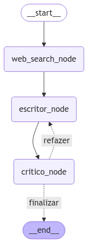

# 🖋️ Sistema Automatizado de Geração e Avaliação de Artigos

Este projeto implementa um sistema automatizado de geração de artigos usando uma **LLM (Large Language Model)** e avaliação textual especializada. O fluxo combina **pesquisa na web**, **geração de conteúdo** e **avaliação detalhada**, garantindo artigos de alta qualidade que podem ser refinados iterativamente com base em críticas construtivas.

---

## 📜 Descrição Geral

O sistema é composto por três principais componentes:

1. **Pesquisa Web**:
   - Utiliza a ferramenta `TavilySearchResults` (do pacote `langchain_community.tools.tavily_search`) para realizar pesquisas web baseadas no tema do artigo.
   - Os resultados da pesquisa são armazenados no estado do gráfico.

2. **Geração de Artigos**:
   - Usa uma LLM, neste caso, o modelo **ChatAnthropic**, para criar artigos detalhados.
   - O prompt para escrita é definido na variável `prompt_escritor`.
   - O artigo gerado é armazenado no estado do gráfico.

3. **Avaliação do Artigo**:
   - Realiza a análise textual e avaliação utilizando outra LLM (**ChatAnthropic**).
   - O prompt de avaliação é configurado na variável `prompt_critico`.
   - O feedback gerado é armazenado no estado do gráfico.

---

## ✨ Fluxo do Sistema

O sistema é controlado por um **gráfico de estado** chamado `work_flow`, que gerencia a transição entre os nós do processo.

### Componentes do Fluxo

1. **web_search_node**:
   - Realiza a pesquisa web com base no tema fornecido.
2. **escritor_node**:
   - Gera o artigo com base nos resultados da pesquisa.
3. **critico_node**:
   - Avalia o artigo gerado e fornece feedback detalhado.

### Transições no Fluxo
- **START → web_search_node**: Inicia a pesquisa web.
- **web_search_node → escritor_node**: Gera o artigo com os dados pesquisados.
- **escritor_node → critico_node**: Avalia o artigo gerado.
- **critico_node → escritor_node (Condicional)**: Decide se o artigo deve ser refeito ou se está pronto para finalização.

### Condições do Fluxo
- **Nota e Iterações**:
   - Se a nota do artigo não atingir um limite mínimo (por exemplo, 9) ou o número máximo de iterações não for alcançado, o artigo será refeito.
   - Caso contrário, o fluxo será finalizado.

---

## 📋 Requisitos

### Dependências
Certifique-se de que as seguintes dependências estejam instaladas:

- **Python 3.9+**
- **Bibliotecas Python**:
  - `langchain-core`
  - `langchain-community`
  - `langchain-anthropic`
  - `python-dotenv`

### Variáveis de Ambiente
As seguintes variáveis de ambiente são obrigatórias:

- **`ANTHROPIC_API_KEY`**: Chave de API para acessar o modelo Anthropic.
- **`TAVILY_API_KEY`**: Chave de API para realizar pesquisas web.

Certifique-se de que essas variáveis estejam configuradas corretamente antes de executar o código.

---
